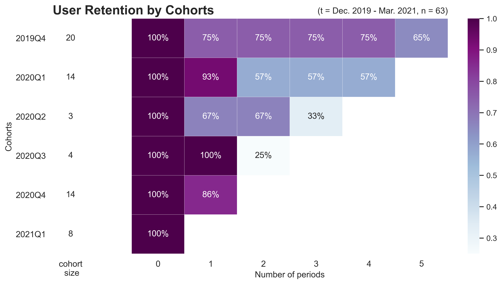

# SupercoApp Data Analysis
Supercoop Friedenau is a FoodCoop based on the New York model. Member-owned and self organized their goal is to provide quality food to their members, with an emphasis on organic and regional products. This repository showcases the data analysis of the SupercoApp and contains only a sample of the original data.

# Functionalities

## Process Data
Takes in the file path to a supercoop json file, processes it and returns three dataframes.

```py
df_orders, df_members, df_products = src.make_dataframes('data/raw/dataexport-2021-06-01-sample.json')
```

## Load Data

Takes in the directory path of the processed data files, loads the data and returns respective dataframes.

```py
df_orders, df_members, df_products = src.load_data('data/processed')
```

## Cohort Analysis
This module uses time-based cohorts to gain insigth to the members retention. Time based cohorts help to separate growth metrics from engagement metrics as growth can easily mask engagement problems. In reality, the activity of old users is often being hidden by the growth numbers of new users.

```py
retention_matrix, cohort_pivot = src.cohort.main(df_members, freq='Q', export_plot=True)
```
Retention plot using the full set of data:



Findings:
- High and healthy member retention: About 65% of members stay engaged over a long time period.
- Members who quit do so early: 3-6 months after a members first engagement the drop-off rate is highest and then flattens out. The rate might be due to the cooperatives 3-month trial membership policy.

## RFM Analysis

RFM analysis is a data driven customer behavior segmentation technique (RFM stands for recency, frequency, and monetary value). The idea is to segment customers based on when their last purchase was, how often they’ve purchased in the past, and how much they’ve spent overall. All three of these measures have proven to be effective predictors of a customer's willingness to engage in future offers.

```py
rfm_table = src.rfm.main(df_members, freq='W', export_csv=True, export_plot=True)
```
RFM plot using the full set of data:


Findings:


# JSON File Structure

The structure of the JSON file (in data/raw) is the following:

An array of orders with the following attributes:
```js
[
  [
    1, // ID
    1, // supplier ID
    {...}, // positions hash
    "2019-12-13", // delivery date
    "2019-12-09 21:16:00.457949", // created at
    "2020-02-18 20:25:54.887435", // updated at
    false, // is the order open?
    0.033, // supercoop margin
    null // supplier margin
  ],
  ...
]
```

The positions hash has the following keys, `members` and `products`.

The member hash has the following properties:
```js
{
  "1": { // member ID as hash key
    "name": "XXX", // member name (anonymized)
    "deposits": { "0.15": 1 }, // the deposits hash has the deposit value in cents as key and the amount a value
    "collected?": true, // marker whether the member already collected his/her products
    "order_requests": { // the products the member ordered
      "3": { "filled": "1.0", "ordered": "1.0" }, // hash key is the product ID, ordered amount is the amount the member wanted to have, filled amount is the amount the member got in the end
      {...}
    }
  },
  "n": {...}
}
```

The products hash has the following properties:
```js
{
 "3": { // product ID as hash key
    "name": "Artischockenherzen geviertelt in Lake",
    "unit": "200g",
    "origin": "Italien",
    "deposit": 0.15, // the value of the deposit per unit
    "category": "Konserven und Gläser",
    "producer": "Rapunzel",
    "tax_rate": 7,
    "net_price": 2.99,
    "bundle_size": 6,
    "supplier_code": "1204060",
    "amount_ordered": 6, // this is the amount that was delivered in the end
    "bundles_ordered": 1
  },
  "n": {...}
}
```

# Setup with Docker
1. Build docker image from Dockerfile
```sh
chmod +x build_image.sh 
./build_image.sh
```
2. Run docker container with iPython as entrypoint
```sh
chmod +x run_container.sh 
./run_container.sh
```
3. Import main package. Run in iPython: 
```python
import src
```

# Next Steps

* Base docker image on [miniconda](https://docs.conda.io/en/latest/miniconda.html) to reduce image size
* Implement unit testing
* Customer-Lifetime-Value analysis with a BG-NBD model
